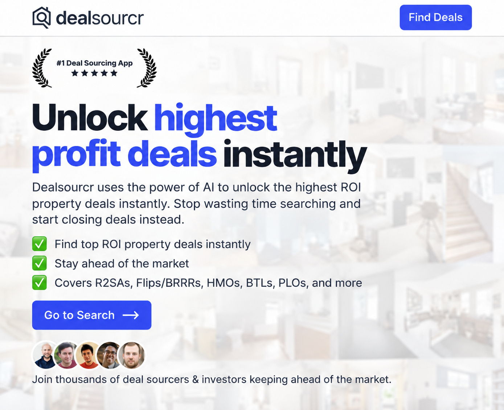
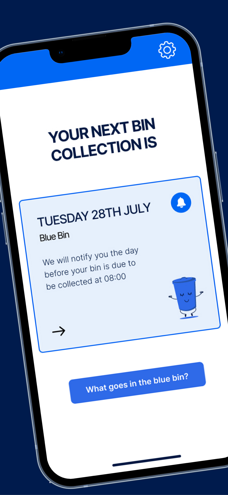

## I build production AI agents and profitable software businesses.

Head of Applied AI at **[Loancrate](https://www.loancrate.com)**. Founder & CTO of **[Dealsourcr](https://dealsourcr.com)**. Building and shipping software since **2003**.

**Dealsourcr: £1.4M cumulative revenue · 1,157 paying subscribers**

Figures recorded in August 2026; revenue in GBP.

[Website](https://ashleyrudland.com) · [LinkedIn](https://www.linkedin.com/in/ashleyrudland) · [Email](mailto:ashleyrudland87@gmail.com) · [Open source](#open-source)

---

### Loancrate · AI agents in production

I lead applied AI at Loancrate, a San Francisco mortgage technology company. I took Loancrate Agent from design into production, building software that works through documents and multi-step loan workflows.

[Explore Loancrate →](https://www.loancrate.com)

### Dealsourcr · From product to subscription business

I built and operate the software behind Dealsourcr, a UK property investment platform bringing together property search, market research and deal analysis. As Founder & CTO, my work spans building the product and running it as a subscription business.

[Explore Dealsourcr →](https://dealsourcr.com) · [Read my growth story →](https://www.indiehackers.com/post/hit-500k-arr-oGw1gSV9SKxrCKPBDlT1)

### JustBin · A free app for an everyday problem

I created JustBin to make household bin collection schedules and reminders easier to use. **Free on iOS and Android.**

[Explore JustBin →](https://justbin.app)

### Onix · Practical agents for businesses

I co-founded Onix, an AI consultancy building agents that use tools and work through multi-step business tasks.

---

### Open source

Practical tools and examples for developers building and hosting their own products.

| Project | What it helps you do | Community |
| :--- | :--- | :--- |
| **[Next.js on a VPS](https://github.com/ashleyrudland/nextjs_vps)** | Host a Next.js application on your own server. | 317 stars · 18 forks |
| **[PHP, jQuery & SQLite starter](https://github.com/ashleyrudland/php-jquery-sqlite-starter-pack)** | Get a product off the ground with a small, straightforward stack. | 43 stars |
| **[AI chatbot on a VPS](https://github.com/ashleyrudland/nextjs-ai-chatbot-on-vps)** | Run my adaptation of Vercel’s chatbot on a VPS. | Adapted from Vercel |

GitHub counts as of 16 September 2026.

### Writing & public work

- **[Growing Dealsourcr to $500k ARR](https://www.indiehackers.com/post/hit-500k-arr-oGw1gSV9SKxrCKPBDlT1)** — my account of growing the business, published on Indie Hackers.
- **[The story behind Dealsourcr](https://www.samuelleeds.com/deal-sourcr-the-new-app-set-to-revolutionise-property-investing/)** — a June 2020 company case study from Property Investors.
- **[Matching property data with deep learning](https://stackoverflow.com/questions/58558378/matching-property-on-heterogenous-data-using-deep-learning)** — a technical question I shared on Stack Overflow.

Previously contracted at **Google** and **Babylon Health**, and co-founded **Circular Wave**, an NHS staffing platform. Based in the United Kingdom.
