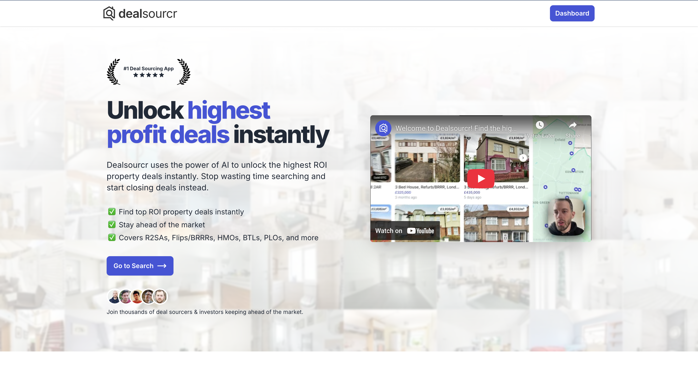

# Ashley Rudland

### I build AI systems that do real work.

Head of Applied AI at **[Loancrate](https://www.loancrate.com)**. Founder of **[Dealsourcr](https://dealsourcr.com)**. Creator of **[JustBin](https://justbin.app)**.

Building and shipping software since 2003, from subscription businesses to AI agents running in production.

[Website](https://ashleyrudland.com) · [LinkedIn](https://www.linkedin.com/in/ashleyrudland) · [Get in touch](mailto:ashleyrudland87@gmail.com)

---

### Selected work

| Product | My work |
| :--- | :--- |
| **[Loancrate](https://www.loancrate.com)** | Lead applied AI at a San Francisco mortgage technology company. Took Loancrate Agent from design into production, working through documents and multi-step loan workflows. |
| **[Dealsourcr](https://dealsourcr.com)** | Built and operate the software behind a UK property investment platform, bringing together property search, market research and deal analysis. |
| **[JustBin](https://justbin.app)** | Built a free mobile app that makes household bin collection schedules and reminders easier to use. Available on iOS and Android. |
| **Onix** | Co-founded an AI consultancy building agents that use tools and work through multi-step business tasks. |

**Dealsourcr:** £1.4M cumulative revenue · 1,157 paying subscribers  
*Figures recorded in August 2026; revenue in GBP.*

### A look at the products

**Dealsourcr**

**JustBin · Free on iOS and Android**

### Tools I share

**[Next.js on a VPS →](https://github.com/ashleyrudland/nextjs_vps)**  
A practical starting point for hosting Next.js on your own server. **317 stars · 18 forks.**

**[PHP, jQuery & SQLite starter →](https://github.com/ashleyrudland/php-jquery-sqlite-starter-pack)**  
A small, straightforward stack for getting products off the ground. **43 stars.**

**[AI chatbot on a VPS →](https://github.com/ashleyrudland/nextjs-ai-chatbot-on-vps)**  
My adaptation of Vercel’s chatbot for VPS hosting.

*GitHub counts as of 16 September 2026.*

### Writing & public work

- **[The $500k ARR milestone](https://www.indiehackers.com/post/hit-500k-arr-oGw1gSV9SKxrCKPBDlT1)** — my account of growing Dealsourcr, published on Indie Hackers.
- **[Building Dealsourcr](https://www.samuelleeds.com/deal-sourcr-the-new-app-set-to-revolutionise-property-investing/)** — a June 2020 company case study from Property Investors.
- **[Matching property data with deep learning](https://stackoverflow.com/questions/58558378/matching-property-on-heterogenous-data-using-deep-learning)** — a technical question I shared on Stack Overflow.

### Experience

Currently **Head of Applied AI at Loancrate**, **Founder & CTO of Dealsourcr**, and **Co-founder & CTO of Onix**. Previously contracted at **Google** and **Babylon Health**, and co-founded **Circular Wave**, an NHS staffing platform.

Based in the United Kingdom. Interested in useful AI, ambitious products and the engineering that makes them work.
